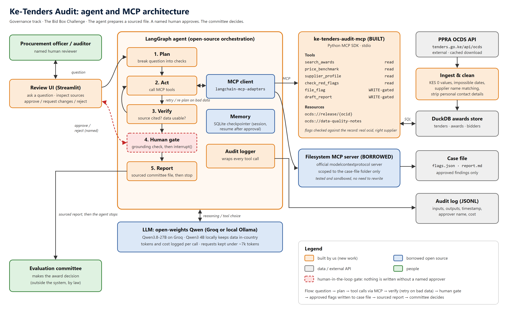

# Ke-Tenders Audit

An agentic AI that prepares a sourced review file on Kenyan public procurement awards for a human
evaluation committee, then stops. It flags patterns. It never awards a tender, never recommends a
winner and never declares wrongdoing. Every write needs a named human's approval.

Built for the African Agentic AI Design Challenge, Governance track (The Bid Box Challenge),
theme **Value for money**.

**Live demo:** https://ke-tenders-audit-bxxfc4gmxjc9mpuuvkzypz.streamlit.app/
(opens on recorded real runs; switch to "Live review" in the sidebar for up to 3 live reviews a day on a free model tier)

```bash
pip install -r requirements.txt && streamlit run app.py
```

(Python 3.12. Put a model key in `.env` first: see [Setup](#setup).)

---

## Problem statement

Kenyan public bodies (county governments, TVET colleges, schools, NG-CDF offices, water companies)
publish every tender and award on the PPRA portal, tenders.go.ke, in the Open Contracting Data
Standard (OCDS). Almost nobody has time to use it. Evaluation committees and internal auditors spend
weeks checking bidders, comparing prices and writing reports; the challenge brief puts it at 26 days
of committee work per tender. Oversight bodies face the opposite problem: thousands of records and no
way to see which ones deserve a second look.

The warning signs are already in the data. In the FY2026/27 release (4,830 tenders, 136 with awards),
23 awards had a single bidder, some suppliers win repeatedly from the same buyer, some contracts are
signed before the tender closed, and some awards sit just below round amounts.

## Which half of the data this is built on

The brief notes that portals publish what was tendered and awarded, not the bids. **This project is
built on the tendered-and-awarded half**: award values, bidder lists on awarded tenders, dates,
methods and buyers. It does not evaluate bid documents, because none are published.

## Solution overview

A reviewer asks a question such as "Review all published awards by PC Kinyanjui Technical Training
Institute". The agent plans the review, calls tools on our MCP server to search awards, run integrity
checks, compare prices and profile suppliers, then proposes flags. Each proposed flag pauses the run
until a named reviewer approves, rejects or requests changes. Approved flags go into a case file, and
the agent drafts a committee report where every finding cites its OCDS record.

What the code enforces, not just the prompt:

- A flag must cite an ocid that a tool actually returned in this run, or it is refused before a human sees it.
- A flag naming a company that is not a bidder or winner on that record is refused, with the correct name.
- Only the human gate can fill `approved_by`; the model cannot approve itself.
- A write the reviewer rejected is refused if the model proposes it again.
- Wording that decides an award or declares guilt is refused.
- Every report ends with a table of all patterns found, computed from the data, so a wrong model summary cannot hide anything.
- No em dashes or en dashes in anything written to the case file.

## Target users

- Procurement evaluation committees and heads of procurement in counties, colleges and state agencies.
- Internal audit units preparing for the Office of the Auditor-General.
- Also useful to oversight bodies, journalists and civil society, and to honest suppliers who gain from fairer competition.

## Architecture



One page: [ARCHITECTURE.md](ARCHITECTURE.md). Project description (about 300 words): [DESCRIPTION.md](DESCRIPTION.md).

## Setup

Requirements: Python 3.12, Node.js 18+ (for the borrowed Filesystem MCP server, run with `npx`).

1. Copy `.env.example` to `.env` and choose a model:
   - **Hosted Qwen on Groq** (free key at console.groq.com): set `KTA_LLM_BASE_URL=https://api.groq.com/openai/v1`,
     `KTA_LLM_MODEL=qwen/qwen3.8-27b` and your key in `KTA_LLM_API_KEY`.
   - **Fully local with Ollama** (data never leaves the machine): install Ollama, run `ollama pull qwen3:4b`,
     and keep the default `http://localhost:11434/v1` settings.
2. Install and start:

```bash
pip install -r requirements.txt && streamlit run app.py
```

The cleaned data ships in `data/clean/releases.jsonl`, so no download is needed. To rebuild it from a
fresh PPRA download, save the JSON from `https://tenders.go.ke/api/ocds/tenders?fy=2026-2027` into
`data/raw/` and run `ke-tenders-ingest`.

## Usage

**Review screen:** enter your full name, ask a question, watch each tool call with its input and output,
then approve, reject or request changes on each proposed flag. Each proposal shows the record's own
facts (title, winner, amount, bidders, method) beside the model's claim, with a red warning on any
mismatch. Download the report when done.

**Terminal:**

```bash
python -m ke_tenders_audit.cli "Review Kilifi County Government's awards." --reviewer "Your Full Name"
```

**Tests and evals:**

```bash
pytest
```

```bash
python evals/run_evals.py --runs 2
```

## Technology stack

| Layer | Choice |
|---|---|
| Orchestration | LangGraph (state graph, `interrupt()` for the human gate, SQLite checkpointer) |
| Model | Qwen3.8-27B (open weights) on Groq; Qwen3 4B locally through Ollama; any OpenAI-compatible endpoint |
| MCP | Official MCP Python SDK (our server), `langchain-mcp-adapters` (client), official Filesystem MCP server (borrowed) |
| Data | DuckDB in memory, built from cleaned OCDS JSONL; RapidFuzz for name matching |
| Interface | Streamlit review screen, plus a terminal runner |
| Logs | Append-only JSONL audit log per run |
| Tests | pytest (36 tests), plus a graded eval harness (see EVALS.md) |

## Agent architecture

```
plan -> agent -> read tools -> tools -> verify -> agent ...
             -> write tools -> grounding check -> human gate -> tools -> verify -> agent ...
             -> no tool calls -> done
```

- **plan**: the model writes a short numbered plan for the request.
- **agent**: the model chooses tools, at most 3 per step.
- **verify**: after each tool round, deterministic checks look for errors, refusals, hints and
  "insufficient comparables", and tell the model plainly so it re-plans instead of guessing.
- **grounding check and human gate**: described above.
- **memory**: LangGraph checkpoints in SQLite, so a run pauses for approval and resumes exactly where it
  stopped, even after an error ("Retry last step").
- **budget**: older tool results are shortened to keep each request under about 7,000 tokens, which
  fits free model tiers. Red-flag results put their totals first so shortening never loses them.

## MCP implementation

Two MCP servers, both connected over stdio through `langchain-mcp-adapters`. A tool interceptor
writes every call (server, tool, inputs, output, duration) to the audit log.

## MCP tools and servers

**Built: `ke-tenders-audit-mcp`** ([server.py](src/ke_tenders_audit/server.py))

| Tool | Kind | What it does |
|---|---|---|
| `search_awards` | read | Find awards by buyer, item, supplier, category, method or date. Explains empty results and suggests close buyer names. |
| `check_red_flags` | read | Single bidder, direct method, signed before close, just below a round amount, repeat winner at the same buyer. Totals first. |
| `price_benchmark` | read | Compare an award with similar awards (same item group and category). Says so when there are fewer than 5. |
| `supplier_profile` | read | Bids, wins, win rate, buyers and single-bidder wins for a company. |
| `file_flag` | write, gated | Add a sourced flag to the case file, with the record's own facts attached. |
| `draft_report` | write, gated | Build the committee report from approved flags, plus the data-computed totals table. |

Resources: `ocds://release/{ocid}` (the cleaned record behind any finding) and
`ocds://data-quality-notes` (known problems in the feed).

**Borrowed: the official Filesystem MCP server** (`@modelcontextprotocol/server-filesystem`), scoped to
the `cases/` folder, read tools only. It lets the agent read earlier case files. It is maintained,
tested and sandboxed to one folder, so writing our own file access would add risk and no value.

## Human-in-the-loop workflow

1. The agent proposes one or more writes. The run pauses (LangGraph `interrupt()`).
2. The reviewer sees each proposal with the record's facts and the full source record.
3. For each one: **Approve**, **Request changes** (with a note the agent uses to revise) or **Reject**
   (never proposed again in this run).
4. The gate writes the reviewer's name into `approved_by`. The audit log records the decision.
5. The final report says who approved it. The committee makes the award decision, outside this system.

## Data conduct

Open data only, from PPRA. Cleaning removes `contactPoint`, street addresses and postal codes, and
strips emails and phone numbers that publishers typed into company names. Company records are used;
no individual's personal details are. No live tender in progress is evaluated: awards are by
definition closed.

## Cost per run

Measured on Groq, Qwen3.8-27B at $0.80 and $4.00 per million input and output tokens: a full buyer
review (31 awards, 7 model calls, 13 tool calls) used about 24,000 input tokens, **about $0.03**. A
single-tender review costs under $0.02. Locally with Ollama the cost is zero. Every run's tokens and cost
are in its audit log. Evaluation results: [EVALS.md](EVALS.md).

## Limitations

- **No bid documents.** The feed has no bids, so technical and financial evaluation of bids is out of scope.
- **Lump sums, not unit prices.** Price comparisons point to scope questions, not proven overpricing.
- **Small award sample.** Only 136 tenders have published awards in FY2026/27, so many items have too few comparables.
- **Item grouping is rule-based.** Free-text titles are grouped with keyword rules; about 7% of awards stay ungrouped.
- **Thresholds are round numbers, not confirmed law.** "Just below a round amount" needs checking against the PPADA Regulations 2020.
- **Free model tier.** On Groq's free tier a review takes 1 to 3 minutes, mostly rate-limit waiting, and about 6 full reviews fit in a day.
- **The model's summary can still be wrong.** The data-computed table at the end of each report is the safeguard.

## Future improvements

- Load past fiscal years (FY2025/26 and earlier) for stronger price comparisons and supplier histories.
- Run against other OCDS portals (Rwanda, Tanzania, Nigeria, South Africa); the tools are schema-generic.
- Confirm PPADA thresholds and replace round amounts with the real limits per procurement method.
- Match suppliers on registration numbers if PPRA publishes them.
- Unit-price extraction from contract documents, where those become public.

## Licence

MIT. See [LICENSE](LICENSE). Data: Public Procurement Regulatory Authority (Kenya), published as open data.
